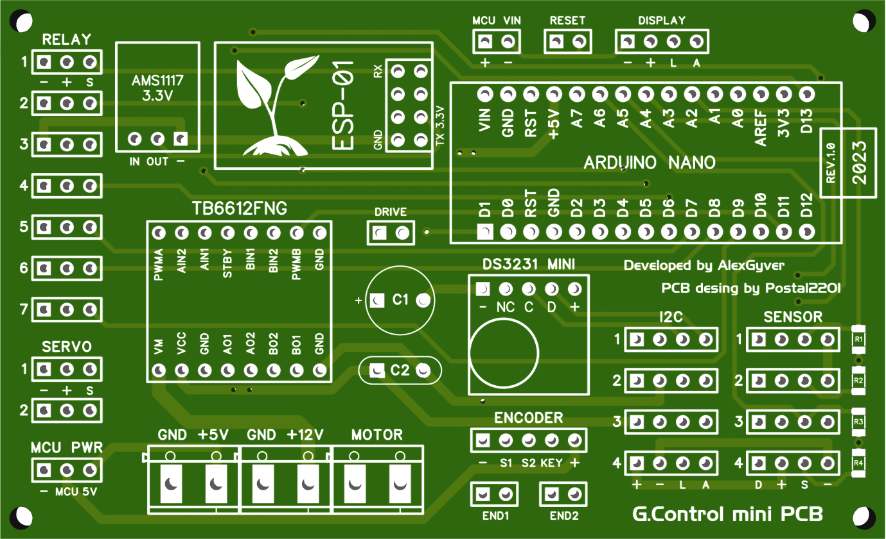
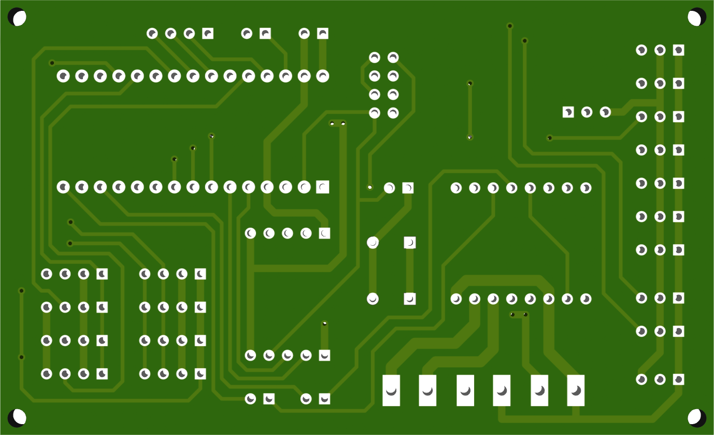

# G.Control-mini-PCB

Mini PCB for **GyverControl** project by **AlexGyver**
- https://github.com/AlexGyver/GyverControl

PCB design by **Postal2201**. Traced in **DipTrace**.

Dimensions and fixing holes of the board match **LCD2004** display board.

## Top Side

## Bottom Side

